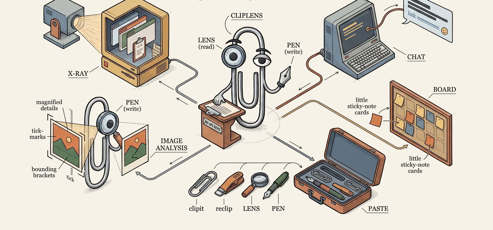

<h1 align="center">ClipLens</h1>

<p align="center"><b>The universal, AI-independent skill for everything clipboard.</b><br/>
<sub>read · write · analyze — any app, any agent, any provider · no API keys</sub></p>

<p align="center">
  
</p>

Drop ClipLens into any agent — Claude Code, Kiro, Copilot, Gemini, Cursor, your own — and it can read and
write the system clipboard in the *native formats real apps use*: generate a Slack message with real
bold/links, a Mural sticky note, an Outlook-ready HTML email, or read back what you copied from Figma/Mural
or a console — with **no API keys, no OAuth, no marketplace approval**. It's provider-agnostic (an MCP server
+ a plain [`SKILL.md`](SKILL.md)) and it just works. Just:

> **generate → clipboard → paste.**

Most integrations die on auth, rate limits, and approval queues. The clipboard doesn't. Every app already
speaks it. ClipLens turns that into a universal adapter layer.

##  Drive it in plain English

No flags to memorize. ClipLens ships as a **provider-agnostic agent skill** ([`SKILL.md`](SKILL.md)) — drop
it into any agent (Claude Code, Kiro, Copilot, Gemini, Cursor…) and just *say what you want*:

> *"paste this as a Slack message"* · *"read the Mural I just copied"* · *"put this table on my clipboard for Outlook"* · *"clean up this console dump"*

Your agent picks the right **lens** or **pen**, writes the native format, and tells you to hit `Ctrl+V`.
A tiny background **clip daemon** flashes a popup so you *see* it land. Prefer the CLI? That works too.

---

##  The idea: Lenses &amp; Pens

| | Direction | What it does |
|---|---|---|
|  **Lens** | READ | Decodes a clipboard payload (Mural `mly://`, Figma, Slack Quill Delta, console dumps) into clean, structured, token-friendly data. |
|  **Pen** | WRITE | Encodes structured input into a real app's clipboard format (Slack rich text, Outlook HTML, Mural widgets, images). |

You paste. The app thinks a human did it.

```
copy / paste
   │
ClipLens  ──►  Lens (read)  ──►  structured data for your agent
          ◄──  Pen  (write) ◄──  your agent's content
   │
native clipboard format  ──►  Ctrl+V into Slack / Mural / Outlook / …
```

##  Proven adapters

| App | Lens<br/>(read) | Pen<br/>(write) | Format &amp; notes |
|-----|:---:|:---:|--------|
| **Slack** | ☐ | ✅ | Quill Delta in a Chromium custom-MIME blob — bold / italic / lists / links / code |
| **Mural** | ✅ | ✅ | `mly://` base64 JSON in HTML clipboard — native stickies &amp; diagrams |
| **Figma** | ✅ | ☐ | selection metadata |
| **Outlook / Teams / Docs** | ☐ | ✅ | HTML-Format clipboard |
| **DevTools console** | ✅ | ☐ | plain text — 99%+ noise reduction |

##  Install

```bash
git clone https://github.com/TheJesper/cliplens
cd cliplens
npm install
npm link          # global CLI aliases
```

##  CLI

| Command | What |
|---------|------|
| `cliplens capture / inspect / diff` | Capture &amp; explore raw clipboard formats |
| `clipit` | Markdown → Slack rich text on the clipboard |
| `clipmail` | Markdown → HTML (Outlook / Teams / Docs) |
| `clipconsole` | Read a pasted DevTools console dump, strip the noise (keep CORS / HTTP / `net::ERR_`) |
| `clipmural` | Write native Mural stickies / diagrams |
| `reclip` | Replay clipboard history |

> 💡 **Give your agent DevTools eyes.** In Chrome, right-click inside the console → **Copy console**, then
> run `clipconsole` (or the `cliplens_analyze` tool). ClipLens strips **99%+ of the noise** — keeping the
> signal (CORS, HTTP statuses, `net::ERR_`, failed requests) — so your agent reads only what matters. No
> screenshots, no copy-paste-scroll.

##  MCP server (agents)

ClipLens ships an MCP server so agents (Claude Code, Kiro, …) can read/write the clipboard as tools.

```json
{
  "mcpServers": {
    "cliplens": { "command": "node", "args": ["<path-to>/cliplens/src/mcp-server.js"] }
  }
}
```

Tools: `cliplens_analyze` · `_text` · `_capture` · `_formats` · `_inspect` · `_save_image` · `_write_slack`
· `_write_plaintext` · `_lens`. Generated text runs through `humanize()` (strips em-dashes, curly quotes,
zero-width spaces, BOM — the tells that a machine wrote it).

##  Clip daemon &amp; popup

`cliplens-daemon` (in [`cliplens-toast/`](cliplens-toast/), **cross-platform Rust** via wry) is an optional
lightweight background service that makes the clipboard *visible*:

- **Popup toast** — when a clip is written, a warm rounded overlay flashes with a pixel-perfect icon, the
  clip **type** as a chip (`Slack` · `Mural` · `Image` · `Prompt` · `Normal`…) and the **sender** (which
  agent made it) as a badge — so you get confirmation without switching windows.
- **Clip-history picker** — a **configurable** global hotkey (default `Shift+Alt+V`, cross-platform,
  macOS + Windows) opens the last N clips to re-paste any of them.

One binary, **one identical design on Windows/macOS/Linux** (HTML/CSS in the webview — no per-OS fallback).
Fire one manually:

```bash
cliplens-daemon --notify --title "ClipLens" --subtitle "Ctrl+V" --type Slack --agent my-agent --kind clip
cliplens-daemon --watch      # run persistently (enables the history picker)
```

**Install:** download a prebuilt binary from [Releases](https://github.com/TheJesper/cliplens/releases)
(built by CI for every OS — **no Rust needed**), or build once with `cargo build --release` in
`cliplens-toast/`. If the daemon isn't present, writes still work and a plain native OS toast fires instead.

##  Private adapters (keep company stuff out of the public repo)

ClipLens ships **only generic, public** lenses &amp; pens. Anything org-specific — an internal tool's format,
a proprietary board, a company log filter — goes in **gitignored** folders so it can never leak upstream:

```
private-lenses/   ← your read adapters   (gitignored)
private-pens/     ← your write adapters  (gitignored)
```

Drop a `.js` file exporting the lens/pen shape (see [`examples/`](examples/)); it's auto-discovered by
`src/private.js`. Nothing in those folders is ever committed. Fork the *core* freely; keep your *adapters* private.

##  Platform

**Windows-first.** Clipboard I/O currently uses PowerShell + `System.Windows.Forms`. The encoding/decoding
logic is pure, cross-platform Node — only the small read/write shim needs porting.

> Developed on [Kiro](https://kiro.dev); works with Claude Code and any MCP agent.
> **Not yet validated on macOS or Linux** — if you're there, a clipboard shim PR would be hugely welcome. 🙏

##  Roadmap — *being worked on as we speak*

- macOS / Linux clipboard shims (the daemon is built cross-platform; the Node clipboard bridge needs porting)
- More lenses &amp; pens (Notion, Miro, Confluence, Jira…)
- Multiclip ring buffer — recall the last 10 clips by timestamp

##  Contributing

You *can* fork — but I'd genuinely rather build this **with** you. Open an issue or a PR and I'll happily
review it. See [CONTRIBUTING.md](CONTRIBUTING.md). This is open source (MIT) and meant to stay that way.

##  License &amp; credits

[MIT](LICENSE) © Jesper Wilfing

Icons: [FatCow Farm-Fresh Web Icons](https://www.fatcow.com/free-icons) — licensed under
[CC BY 3.0](https://creativecommons.org/licenses/by/3.0/).
